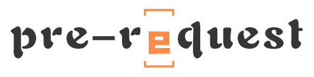

.. rst-class:: hide-header

.. rst-class:: hide-header

欢迎使用 pre-request 框架
=========================

欢迎您使用pre-request框架，pre-request致力于简化请求参数验证工作。为Flask的
网络请求参数验证提供了解决方案。

pre-request提供了非常方便的使用的方法，也提供了灵活的扩展接口方便您实现自定义的
业务逻辑。

本文档将带您一步步使用pre-request框架。

.. toctree::
    :maxdepth: 2

    installation
    quickstart
    intro
    customize
